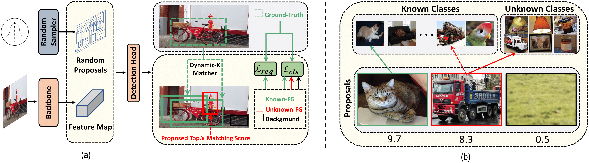

## Random Boxes Are Open-world Object Detectors

**RandBox is a novel and effective model for open-world object detection.**




> [**Random Boxes Are Open-world Object Detectors**](https://arxiv.org/abs/2307.08249)               
> Yanghao Wang, Zhongqi Yue, Xian-sheng Hua, Hanwang Zhang                 
> *[arXiv 2307.08249](https://arxiv.org/pdf/2307.08249.pdf)* 

## Updates
- (07/2023) Code is released.

## Models
Task | K-mAP | U-R | WI | A-OSE | Download
--- |:---:|:---:|:---:|:---:|:---:
[Task 1](configs/t1.yaml) | 61.8 | 10.6 | 0.0240 | 4498 |[model](https://drive.google.com/file/d/1HjvHm7YQ9VMUbU5mDIGmXg8BWtDqmGGn/view)
[Task 2](configs/t2_ft.yaml) | 45.3 | 6.3 | 0.0078 | 1880 |[model](https://drive.google.com/file/d/1eAidoPpZh3Agm4hgBY9RP4zeZefnJmqJ/view)
[Task 3](configs/t3_ft.yaml) | 39.4 | 7.8 | 0.0054 | 1452 |[model](https://drive.google.com/file/d/1LW8_5DZbjURdWejWdMdT1mdK-5NU9Z4p/view)
[Task 4](configs/t4_ft.yaml) | 35.4 | - | - | - |[[model](https://drive.google.com/file/d/1ljZA2DZCxPt5FDkqdpMUqTW04X23CSwb/view)](https://github.com/ShoufaChen/DiffusionDet/releases/download/v0.1/diffdet_lvis_res50.pth)


## Getting Started

The installation instruction and usage are in [Getting Started with RandBox](GETTING_STARTED.md).


## Citing RandBox

If you use RandBox in your research or wish to refer to the baseline results published here, please use the following BibTeX entry.

```BibTeX
@misc{wang2023random,
      title={Random Boxes Are Open-world Object Detectors}, 
      author={Yanghao Wang and Zhongqi Yue and Xian-Sheng Hua and Hanwang Zhang},
      year={2023},
      eprint={2307.08249},
      archivePrefix={arXiv},
      primaryClass={cs.CV}
}
```
